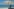
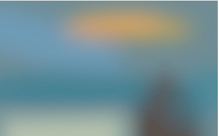
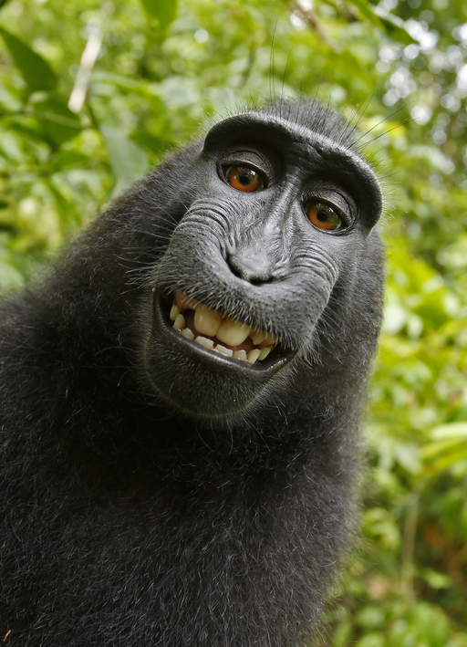
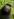
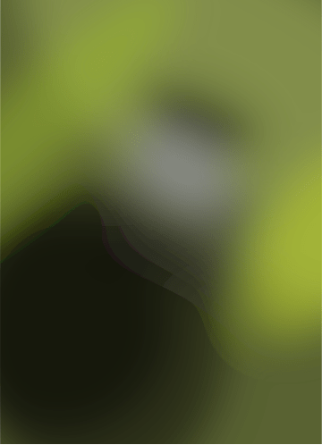
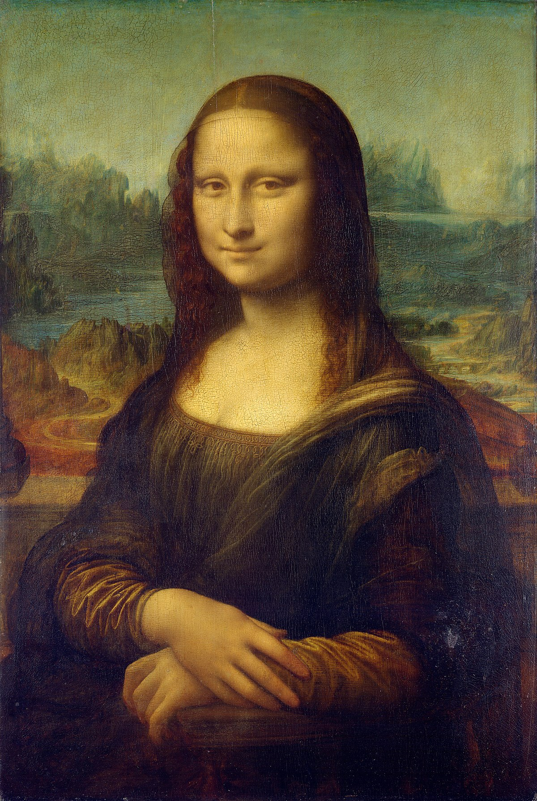
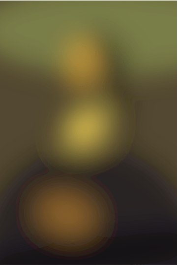
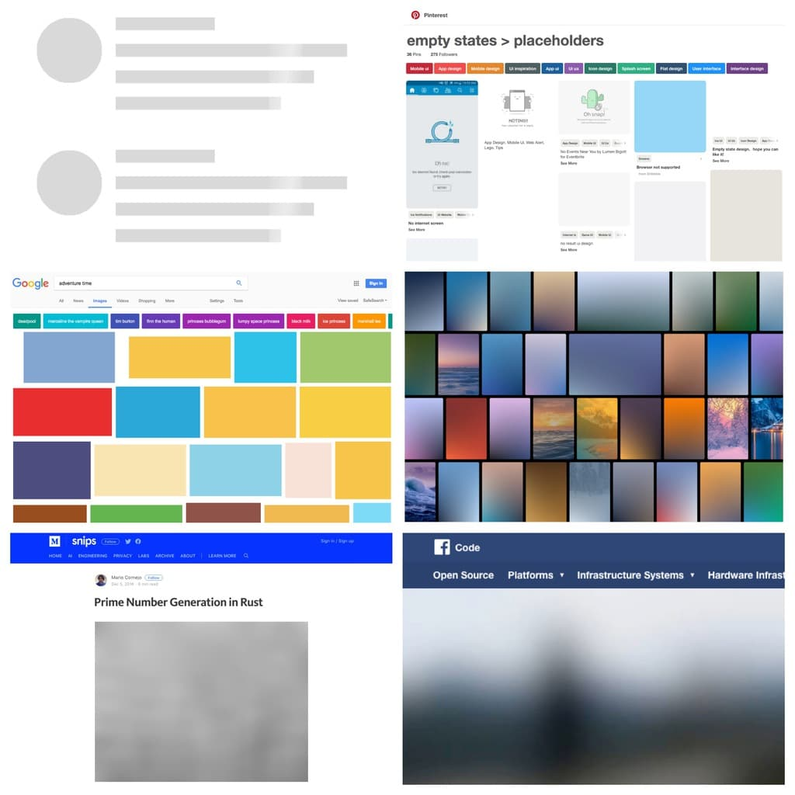

SQIP - SVG-Based Image Placeholder
====================
## Overview

"SQIP" (pronounced \skwɪb\ like the non-magical folk of magical descent) is a
SVG-based [LQIP](https://www.guypo.com/introducing-lqip-low-quality-image-placeholders/) technique.

## Examples

| Original | LQIP | SQIP default |
|----------|------|--------------|
|  |  |  |
| Size: | 354B | 895B (gz: 479B) |
|  |  |  |
| Size: | 435B | 980B (gz: 513B) |
|  |  |  |
| Size: | 442B | 937B (gz: 487B) |

## Requirements
* Node.js >= v6 (https://nodejs.org/en/)

### Non-64bit operating systems need:
* Golang (https://golang.org/doc/install)
* Primitive (https://github.com/fogleman/primitive) (`go get -u github.com/fogleman/primitive`)

After installing Primitive, you may also need to add the path to the ```Primitive``` binary file.

#### For macOS
It would generally look something like
```bash
/Users/myMacbook/go/bin
```
To do this on a Mac, type: ```sudo vim /etc/paths``` into your terminal, and add the path to your ```Primitive``` binary file, but be sure to add the full path, ```/Users/<username>/go/bin``` and not ```~/go/bin```.

#### For PC
Using the command line (https://www.windows-commandline.com/set-path-command-line) <br>
Using a GUI (https://www.computerhope.com/issues/ch000549.htm)

## Installation
```bash

npm install -g sqip

```

## Background

Image placeholders are a thing: from grey boxes in skeleton screens over boxes
that show the predominant color of the image that will later occupy the space
and CSS color gradients made from two dominant colors up to actual low quality
raster images downscaled to a few pixels, saved in low quality and then blurred
to provide a preview of image contents.

Many major players have adopted one of these image placeholder techniques:
[Guypo](https://twitter.com/guypod) [incepted
LQIP](https://www.guypo.com/introducing-lqip-low-quality-image-placeholders/) in
2012 and Akamai adopted it as part of their image optimization tools, Google
started using colored placeholders a long time ago,
[Facebook](https://code.facebook.com/posts/991252547593574/the-technology-behind-preview-photos/),
[Pinterest](https://blog.embed.ly/pinterests-colored-background-placeholders-4b4c9fb8bb77)
and
[Medium](https://jmperezperez.com/medium-image-progressive-loading-placeholder/)
made a significant impact with their LQIP implementations and the most popular
[JS libraries for responsive
images](https://github.com/aFarkas/lazysizes#lqipblurry-image-placeholderblur-up-image-technique)
include LQIP implementations.

**Overview of Image Placeholder Techniques**
[](https://raw.githubusercontent.com/technopagan/sqip/master/demo/placeholder-overview.jpg)

On the low end of the bytesize spectrum of image placeholder implementations, we
have skeleton screens and colored boxes, weighing only a few extra bytes each,
but providing no preview of image contents. On the high end of the bytesize
spectrum, the LQIP technique ships an actual raster image, which gives a good
initial impression of image contents to come, but weighs more heavily in
bytesize.

If we disregard Facebooks's native-app implementation of shipping a custom image
decoder that enables them to hardcode image headers, the current minimum
bytesize for LQIP raster images is ~400-600 bytes. At this byterange, the
preview image often looks distorted and coarse, especially on HiDPI screens.
Many other LQIP implementations go for preview images of ~2kb in size, which
provides a much better initial visual impression but comes at the cost of
significantly increased bytesize for the LQIP implementation.

SQIP is an attempt to find a balance between these two extremes: it makes use
of [Primitive](https://github.com/fogleman/primitive) to generate a SVG
consisting of several simple shapes that approximate the main features visible
inside the image, optimizes the SVG using [SVGO](https://github.com/svg/svgo)
and adds a Gaussian Blur filter to it. This produces a SVG placeholder which
weighs in at only ~800-1000 bytes, looks smooth on all screens and provides an
visual cue of image contents to come.

## CLI Examples

```bash

# Generate a SVG placeholder and print an example  tag to stdout
sqip input.jpg

# Save the placeholder SVG to a file instead of printing the  to stdout
sqip -o output.svg input.jpg

# Customize the number of primitive SVG shapes (default=8) to influence bytesize or level of detail
sqip -n 4 input.jpg

# Specify the type of primitive shapes that will be used to generate the image (default=0)
# 0=combo, 1=triangle, 2=rect, 3=ellipse, 4=circle, 5=rotatedrect, 6=beziers, 7=rotatedellipse, 8=polygon
sqip -m 4 input.jpg

# Set the gaussian blur (default=12)
sqip -b 3 input.jpg
```

### NODE API
Node API takes filename and number of primitives in an object, returns an object
with SVG, base64 encoded SVG and image dimensions.

Input options:
- filename (required)
- numberOfPrimitives (default=8)
- mode (default=0)
- blur (default=12)

Returns:
- final_svg - string
- svg_base64encoded - string
- img_dimensions - object

**Examples**
```javascript
const sqip = require('sqip');

const result =  sqip({
    filename: './input.jpg',
    numberOfPrimitives: 10
});
```

## Credits
* trivago N.V. (https://github.com/trivago)
* Efe Gürkan Yalaman (https://github.com/efegurkan)
* Michael Fogleman (https://github.com/fogleman)

## Licence

This is free and unencumbered software released into the public domain.

Anyone is free to copy, modify, publish, use, compile, sell, or
distribute this software, either in source code form or as a compiled
binary, for any purpose, commercial or non-commercial, and by any
means.

In jurisdictions that recognize copyright laws, the author or authors
of this software dedicate any and all copyright interest in the
software to the public domain. We make this dedication for the benefit
of the public at large and to the detriment of our heirs and
successors. We intend this dedication to be an overt act of
relinquishment in perpetuity of all present and future rights to this
software under copyright law.

THE SOFTWARE IS PROVIDED "AS IS", WITHOUT WARRANTY OF ANY KIND,
EXPRESS OR IMPLIED, INCLUDING BUT NOT LIMITED TO THE WARRANTIES OF
MERCHANTABILITY, FITNESS FOR A PARTICULAR PURPOSE AND NONINFRINGEMENT.
IN NO EVENT SHALL THE AUTHORS BE LIABLE FOR ANY CLAIM, DAMAGES OR
OTHER LIABILITY, WHETHER IN AN ACTION OF CONTRACT, TORT OR OTHERWISE,
ARISING FROM, OUT OF OR IN CONNECTION WITH THE SOFTWARE OR THE USE OR
OTHER DEALINGS IN THE SOFTWARE.

For more information, please refer to [<http://unlicense.org/>](http://unlicense.org/)
