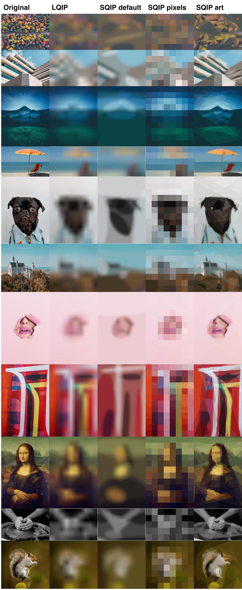

**This is the `v1 alpha` readme. [You can find the current docs here.](https://github.com/axe312ger/sqip/tree/legacy#readme)**

SQIP - a pluggable image converter with vector support
====================

[](https://www.npmjs.com/package/sqip)
[](https://www.npmjs.com/package/sqip)
[](https://www.npmjs.com/package/sqip)

[](https://circleci.com/gh/axe312ger/sqip)
[](https://codecov.io/gh/axe312ger/sqip)
[](https://codeclimate.com/github/axe312ger/sqip/maintainability)
[](CODE_OF_CONDUCT.md)

**SQIP** is a flexible, and a little bit different image processor. It is available as node API and CLI.

By combining plugins you can use it for several purposes:

* Create super-tiny image previews to improve your websites lazy loading experience
* Do art by converting images into abstract representations of themselfes
* Quickly convert, resize or optimize a set of pixel or vector images
* More? Ideas, contributions and community plugins are very welcome


## Table of contents

* [Examples](#Examples)
* [Requirements](#Requirements)
* [Node](#Node)
* [CLI](#CLI)
* [Config](#Config)
* [Plugins](#plugins-1)
* [Background & reseach](#background--reseach)
* [Credits](#Credits)
* [Contributing](#Contributing)
* [License](#License)

## Examples

Get a more detailed look on [our demo website](https://axe312ger.github.io/sqip/).

[](https://axe312ger.github.io/sqip/)

## Requirements

* Node.js >= v8 (https://nodejs.org/en/)
* 64bit OS (Not all plugins, see below)

<details>
<summary>
<strong>Non-64bit operating systems requirements</strong>
</summary>

The most common plugin `sqip-plugin-primitive` is packed with a 64bit executable for all 3 major operating systems. Users with non 32-bit operating system or those who simply want to use the latest and greatest verison of primitive need:

* Golang (https://golang.org/doc/install)
* Primitive (https://github.com/hashbite/primitive) (`go get -u github.com/hashbite/primitive`)

After installing Primitive, you may also need to add the path to the ```Primitive``` binary file.

#### For macOS

It would generally look something like

```bash
/Users/myMacbook/go/bin
```

To do this on a Mac, type: ```sudo vim /etc/paths``` into your terminal, and add the path to your ```Primitive``` binary file, but be sure to add the full path, ```/Users/<username>/go/bin``` and not ```~/go/bin```.

#### For PC

Using the command line (https://www.windows-commandline.com/set-path-command-line)
Using a GUI (https://www.computerhope.com/issues/ch000549.htm)

</details>

## Node

[CLI see here](#cli)

### Installation

You need the core plugin `sqip` plus all the plugins you want to use like `sqip-plugin-primtive`, `sqip-plugin-svgo` and more.

For example:

```bash
npm install sqip@canary sqip-plugin-primitive@canary sqip-plugin-svgo@canary sqip-plugin-data-uri@canary
```

**This is the `v1 alpha` readme. [Click here for v0 "stable" instructions.](https://github.com/axe312ger/sqip/tree/legacy#readme)**

**Hint:** SQIP is plugin based, you might want to install more plugins later on. See [Plugins](#plugins-1) section.

### Usage

SQIP is async.

```js
try {
  const result = await sqip({...options})
  console.log(result)
} catch (err) {
  console.error(err)
}

// or

sqip({...options})
  .then(result => console.log(result))
  .catch(error => console.error(error))
```

If you passed a single image to process, SQIP will return the following result object:

```js
{
  content: Buffer.from('<svg xmlns="http://www.w3.org/2000/svg" viewBox="0 0 300 188">...</svg>'),
  metadata: {
    originalWidth: 1024,
    originalHeight: 640,
    palette: {
      Vibrant: Vibrant.Swatch,
      DarkVibrant: Vibrant.Swatch,
      LightVibrant: Vibrant.Swatch,
      Muted: Vibrant.Swatch,
      DarkMuted: Vibrant.Swatch,
      LightMuted: Vibrant.Swatch
    },
    width: 300,
    height: 188,
    type: 'svg',
    // These will be added by sqip-plugin-data-uri
    dataURI: "data:image/svg+xml,...",
    dataURIBase64: 'data:image/svg+xml;base64,...'
  }
}
```

Documentation for all 6 colors from the palette: [Vibrant.Swatch](https://github.com/akfish/node-vibrant#vibrantswatch)

Plugins might add their own meta data

Multiple input images will result in an array of result objects.


#### Process folder with default settings

```js
import sqip from 'sqip' // in node will be => const sqip = require('sqip').default
import { resolve } from 'path'

;(async () => {
  try {
    // Process whole folder with default settings
    const folderResults = await sqip({
      input: resolve(__dirname, 'images/originals'),
      output: resolve(__dirname, 'images/previews')
    })
    console.log(folderResults)
  } catch (err) {
    console.log('Something went wrong generating the SQIP previews')
    console.error(err)
  }
})()
```

#### Use custom plugin config

This will run:

* Primitive with custom settings
* SVGO with default settings

```js
;(async () => {
  const pluginResults = await sqip({
    input: resolve(__dirname, 'images/originals'),
    output: resolve(__dirname, 'images/previews'),
    plugins: [
      {
        name: 'sqip-plugin-primitive',
        options: {
          numberOfPrimitives: 8,
          mode: 0,
        },
      },
      'sqip-plugin-svgo',
    ],
  })
  console.log(pluginResults)
})()
```

[For further configuration options see here](#config)


## CLI

### Installation

```sh
npm install -g sqip-cli@canary
```

**This is the `v1 alpha` readme. [You can find the current docs here.](https://github.com/axe312ger/sqip/tree/legacy#readme)**

### Usage examples

#### Using the help efficently

Make sure to specify plugins when using `--help` to see the available plugin options.

```sh
sqip -h -p primitive -p blur -p svgo
```

<details>
<summary>Result:</summary>

```sh
sqip CLI

  Usage: sqip --input [path]

  "SQIP" (pronounced skwɪb like the non-magical folk of magical descent) is a
  SVG-based LQIP technique - https://github.com/technopagan/sqip

Options

  -h, --help                                  Show help
  --version                                   Show version number
  -p, --plugins string[]                      One or more plugins. E.g. "-p primitive blur"
  -i, --input string
  -o, --output string                         Save the resulting SVG to a file. The svg result will be returned by default.
  -n, --primitive-numberOfPrimitives number   The number of primitive shapes to use to build the SQIP SVG
  -m, --primitive-mode number                 The style of primitives to use:
                                              0=combo, 1=triangle, 2=rect, 3=ellipse, 4=circle, 5=rotatedrect, 6=beziers,
                                              7=rotatedellipse, 8=polygon
  -b, --blur-blur number                      Set the GaussianBlur SVG filter value. Disable it via 0.

Examples

  Output input.jpg image as SQIP
  $ sqip --input /path/to/input.jpg

  Save input.jpg as result.svg with 25 shapes and no blur
  $ sqip -i input.jpg -n 25 -b 0 -o result.svg
```
</details>

#### Process single file

```sh
$ sqip -i __tests__/fixtures/beach.jpg
Processing: __tests__/fixtures/beach.jpg
[Preview image (iTerm2 users only)]
┌───────────────┬────────────────┬───────┬────────┬──────┐
│ originalWidth │ originalHeight │ width │ height │ type │
├───────────────┼────────────────┼───────┼────────┼──────┤
│ 1024          │ 640            │ 300   │ 188    │ svg  │
└───────────────┴────────────────┴───────┴────────┴──────┘
┌─────────┬─────────────┬──────────────┬─────────┬───────────┬────────────┐
│ Vibrant │ DarkVibrant │ LightVibrant │ Muted   │ DarkMuted │ LightMuted │
├─────────┼─────────────┼──────────────┼─────────┼───────────┼────────────┤
│ #dd852f │ #be4e0c     │ #f2b17a      │ #5c8fa4 │ #694e35   │ #cfc8b7    │
└─────────┴─────────────┴──────────────┴─────────┴───────────┴────────────┘
```

##### Process multiple files via glob and use custom plugin config

```sh
sqip -p primitive -p blur -p svgo \
-i "demo/*.jpg" \
-b 6
```

[For further configuration options see here](#config)

## Config

The configuration consists of three parts. A required input, an optional output path and a configuration of plugins to be applied on the images.

### `input` - required

Input file or directory. Supports feature rich globbing via [micromatch](https://github.com/micromatch/micromatch#why-use-micromatch).

**CLI usage:** `-i/--input`

### `output`

If set, the output will be written to the given file or directory.

Otherwise, results will be output to CLI

**CLI usage:** `-o/--output`

### `width`

Set the width of the resulting image. Negative values and 0 will fall back to the original image width.

**CLI usage:** `-w/--width`

### `plugins`

**Default:** `['primitive', 'svgo']`

Array of plugins. Either as a string (default config will be applied) or as a config object.

**Example:**

```js
await sqip({
  ...
  plugins: [
    {
      name: 'sqip-plugin-primitive',
      options: {
        numberOfPrimitives: 8,
        mode: 0,
      },
    },
    `sqip-plugin-svgo`,
  ],
})
```

**CLI usage:**

`-p/--plugins`

* Can be specified multiple times: `-p svgo -p blur`
* If prefix was skipped, plugin names will be transformed to: `sqip-plugin-[name]`
* To set plugin options, see [plugin specifc config](#plugin-specific-confic)

### Plugin specific config

* See the [Plugins](#plugins) section for a list of available plugins.
* List all plugins subcommands by adding the plugin plus using the help parameter. For example: `-p blur -p svgo -h` will list you all options of the blur and the svgo plugins.
* Follows the pattern `--[plugin-name]-[option]=[value]`

**Example:**

Set `blur` option of `blur` plugin to 3. You could use the `-b` shortcut as well.

```sh
sqip -i foo.jpg -p primitive -p blur -blur-blur 3
```

### `--parseable-output` (CLI only)

non-TTY consoles and when the `--parseable-output` input flag is set, the output will be the following:

```sh
$ sqip -i __tests__/fixtures/beach.jpg --parseable-output
Processing: __tests__/fixtures/beach.jpg
originalWidth originalHeight width height type
1024          640            300   188    svg
Vibrant DarkVibrant LightVibrant Muted   DarkMuted LightMuted
#dd852f #be4e0c     #f2b17a      #5c8fa4 #694e35   #cfc8b7
```

### `--silent` (CLI only)

No output at all on STDOUT. The process will still return an error code & message when something failed.

## Plugins

SQIP comes with some core plugins, the community is very welcome to [contribute their own plugins](#contributing) to SQIP. The effort to implement a tool or script doing something with images into SQIP is very minimal.

### Core plugins

Here is a list of all current core plugins:

* [sqip-plugin-primitive](https://github.com/axe312ger/sqip/tree/master/packages/sqip-plugin-primitive#readme)
* [sqip-plugin-blur](https://github.com/axe312ger/sqip/tree/master/packages/sqip-plugin-blur#readme)
* [sqip-plugin-svgo](https://github.com/axe312ger/sqip/tree/master/packages/sqip-plugin-svgo#readme)
* [sqip-plugin-datauri](https://github.com/axe312ger/sqip/tree/master/packages/sqip-plugin-datauri#readme)
* [sqip-plugin-pixels](https://github.com/axe312ger/sqip/tree/master/packages/sqip-plugin-pixels#readme)
* [sqip-plugin-potrace](https://github.com/axe312ger/sqip/tree/master/packages/sqip-plugin-potrace#readme)

## Debugging

If something is not going as expected, adding debug output might help a lot. You can achieve this by setting the `DEBUG` environment variable to `sqip*`.

On a *NIX environment, you might do the following:

```sh
DEBUG=sqip* node myscript.js

# or for CLI:

DEBUG=sqip* sqip --input...
```

## Background & reseach about image placeholder & previews

Image placeholders are a thing: from grey boxes in skeleton screens over boxes
that show the predominant color of the image that will later occupy the space
and CSS color gradients made from two dominant colors up to an actual low quality
raster images downscaled to a few pixels, saved in low quality and then blurred
to provide a preview of image contents.

Many major players have adopted one of these image placeholder techniques:
[Guypo](https://twitter.com/guypod) [incepted
LQIP](https://www.guypo.com/introducing-lqip-low-quality-image-placeholders/) in
2012 and Akamai adopted it as part of their image optimization tools, Google
started using colored placeholders a long time ago,
[Facebook](https://code.facebook.com/posts/991252547593574/the-technology-behind-preview-photos/),
[Pinterest](https://blog.embed.ly/pinterests-colored-background-placeholders-4b4c9fb8bb77)
and
[Medium](https://jmperezperez.com/medium-image-progressive-loading-placeholder/)
made a significant impact on their LQIP implementations and the most popular
[JS libraries for responsive
images](https://github.com/aFarkas/lazysizes#lqipblurry-image-placeholderblur-up-image-technique)
include LQIP implementations.

**Overview of Image Placeholder Techniques**
[](https://raw.githubusercontent.com/technopagan/sqip/master/demo/placeholder-overview.jpg)

On the low end of the bytesize spectrum of image placeholder implementations, we
have skeleton screens and colored boxes, weighing only a few extra bytes each,
but providing no preview of image contents. On the high end of the bytesize
spectrum, the LQIP technique ships an actual raster image, which gives a good
initial impression of image contents to come, but weighs more heavily in
bytesize.

If we disregard Facebooks's native-app implementation of shipping a custom image
decoder that enables them to hardcode image headers, the current minimum
bytesize for LQIP raster images is ~400-600 bytes. At this byterange, the
preview image often looks distorted and coarse, especially on HiDPI screens.
Many other LQIP implementations go for preview images of ~2kb in size, which
provides a much better initial visual impression but comes at the cost of
significantly increased bytesize for the LQIP implementation.

SQIP is an attempt to find a balance between these two extremes: it makes use
of [Primitive](https://github.com/hashbite/primitive) to generate a SVG
consisting of several simple shapes that approximate the main features visible
inside the image, optimizes the SVG using [SVGO](https://github.com/svg/svgo)
and adds a Gaussian Blur filter to it. This produces a SVG placeholder which
weighs in at only ~800-1000 bytes, looks smooth on all screens and provides an
visual cue of image contents to come.

## Contributing

[](CODE_OF_CONDUCT.md)

Before contribution, please make sure to read the [contribution guidelines](./CONTRIBUTING.md) guidelines and the [code of conduct](./CODE_OF_CONDUCT.md).

Pull requests, forks and stars are always welcome. For bugs and feature requests, [please create an issue](https://github.com/axe312ger/sqip/issues/new).

## Credits

* trivago N.V. (https://github.com/trivago)
* Efe Gürkan Yalaman (https://github.com/efegurkan)
* Benedikt Rötsch (https://github.com/axe312ger)
* Michael Fogleman (https://github.com/fogleman)

## License

This is free and unencumbered software released into the public domain.

Anyone is free to copy, modify, publish, use, compile, sell, or
distribute this software, either in source code form or as a compiled
binary, for any purpose, commercial or non-commercial, and by any
means.

In jurisdictions that recognize copyright laws, the author or authors
of this software dedicate any and all copyright interest in the
software to the public domain. We make this dedication for the benefit
of the public at large and to the detriment of our heirs and
successors. We intend this dedication to be an overt act of
relinquishment in perpetuity of all present and future rights to this
software under copyright law.

THE SOFTWARE IS PROVIDED "AS IS", WITHOUT WARRANTY OF ANY KIND,
EXPRESS OR IMPLIED, INCLUDING BUT NOT LIMITED TO THE WARRANTIES OF
MERCHANTABILITY, FITNESS FOR A PARTICULAR PURPOSE AND NONINFRINGEMENT.
IN NO EVENT SHALL THE AUTHORS BE LIABLE FOR ANY CLAIM, DAMAGES OR
OTHER LIABILITY, WHETHER IN AN ACTION OF CONTRACT, TORT OR OTHERWISE,
ARISING FROM, OUT OF OR IN CONNECTION WITH THE SOFTWARE OR THE USE OR
OTHER DEALINGS IN THE SOFTWARE.

For more information, please refer to [<http://unlicense.org/>](http://unlicense.org/)
