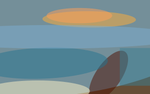

# `sqip-plugin-blur`

> SQIP plugin to add CSS or SVG blur effects to images

Adds a blur effect to SVG output using pure SVG/CSS generation — no external image processing dependencies. Supports modern CSS `filter: blur()` (default) or legacy SVG `feGaussianBlur`. Typically used after a shape-generating plugin (like `primitive` or `pixels`) to smooth the preview image.

## Examples

| Original (59 KB) | Primitive + Blur (962 B) | Primitive only, no blur (2.9 KB) |
|---|---|---|
|  |  |  |

> Try the [interactive demo](https://sqip.vercel.app/) to compare all plugins and configurations side by side.

## Installation

```bash
npm install sqip sqip-plugin-blur
```

## Options

| Option            | Type           | Default   | CLI Flag | Description                                                          |
| ----------------- | -------------- | --------- | -------- | -------------------------------------------------------------------- |
| `blur`            | Number/String  | `12`      | `-b`     | Blur value — number of px for CSS blur, or stdDeviation for SVG blur |
| `legacyBlur`      | Boolean        | `false`   |          | Use SVG `feGaussianBlur` filter instead of CSS `filter: blur()`      |
| `backgroundColor` | String         | `'Muted'` |          | Background rectangle color to prevent transparent edges when blurring. Hex value or palette color name. |

### CSS Blur vs Legacy SVG Blur

By default, the blur plugin uses CSS `filter: blur(Npx)` which is lightweight and well-supported in modern browsers. Set `legacyBlur: true` to use an inline SVG `feGaussianBlur` filter instead, which increases SVG size but works in older environments.

## Usage

### Node API

```js
import { sqip } from 'sqip'

const result = await sqip({
  input: 'photo.jpg',
  plugins: [
    'sqip-plugin-primitive',
    // remove or comment out to disable blur
    { name: 'sqip-plugin-blur', options: { blur: 12 } },
    'sqip-plugin-svgo',
  ],
})
```

### CLI

```bash
# Default blur
sqip -i photo.jpg -p primitive -p blur -p svgo

# Custom blur value
sqip -i photo.jpg -p primitive -p blur -p svgo -b 6

# No blur — just omit the blur plugin
sqip -i photo.jpg -p primitive -p svgo
```

## Part of SQIP

This plugin is part of the [SQIP](https://github.com/axe312ger/sqip) project. See the main README for the full list of plugins and integrations.
