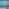

# `sqip-plugin-blurhash`

> SQIP plugin to generate BlurHash previews

Generates a [BlurHash](https://blurha.sh/) string and a small JPEG preview from the input image using the [blurhash](https://github.com/woltapp/blurhash) library for encoding/decoding and [sharp](https://sharp.pixelplumbing.com/) for producing the JPEG output.

Unlike other SQIP plugins that produce SVG output, this plugin outputs a tiny JPEG buffer. The primary result is the hash string (available in `metadata.blurhash`) which can be decoded client-side using any BlurHash library. The plugin also produces a small JPEG preview as a Base64 data URI in `metadata.dataURIBase64`.

## Examples

| Original (59 KB) | BlurHash — default (283 B) | BlurHash — detailed, width=10 (302 B) |
|---|---|---|
|  |  |  |

> Try the [interactive demo](https://sqip.vercel.app/) to compare all plugins and configurations side by side.

## Installation

```bash
npm install sqip sqip-plugin-blurhash
```

## Options

| Option         | Type   | Default | CLI Flag                  | Description                                                   |
| -------------- | ------ | ------- | ------------------------- | ------------------------------------------------------------- |
| `width`        | Number | `4`     | `--blurhash-width`        | Horizontal blur components (max 9) — higher = more detail     |
| `height`       | Number | `-1`    | `--blurhash-height`       | Vertical blur components (max 9, -1 = auto based on aspect)   |
| `resizeWidth`  | Number | `64`    | `--blurhash-resizeWidth`  | Resize image to this width before processing (for speed)      |
| `resizeHeight` | Number | `-1`    | `--blurhash-resizeHeight` | Resize image to this height (-1 = auto based on aspect)       |

## Output

The plugin adds the following to `result.metadata`:

| Field           | Description                                            |
| --------------- | ------------------------------------------------------ |
| `blurhash`      | The BlurHash string (e.g. `LKO2?V%2Tw=w]~RBVZRi};RPxuwH`) |
| `dataURIBase64` | Base64-encoded JPEG preview as a data URI              |

### Decoding on the Client

Use any [BlurHash decoder](https://blurha.sh/) to render the hash client-side:

```js
import { decode } from 'blurhash'

const pixels = decode('LKO2?V%2Tw=w]~RBVZRi};RPxuwH', 32, 32)
```

## Usage

### Node API

```js
import { sqip } from 'sqip'

// Default settings
const result = await sqip({
  input: 'photo.jpg',
  plugins: ['sqip-plugin-blurhash'],
})

console.log(result.metadata.blurhash)      // "LKO2?V%2Tw=w]~RBVZRi};RPxuwH"
console.log(result.metadata.dataURIBase64) // "data:image/jpeg;base64,..."

// Higher detail
const detailed = await sqip({
  input: 'photo.jpg',
  plugins: [
    { name: 'sqip-plugin-blurhash', options: { width: 10 } },
  ],
})
```

### CLI

```bash
# Default
sqip -i photo.jpg -p blurhash

# Higher detail
sqip -i photo.jpg -p blurhash --blurhash-width 10
```

## Part of SQIP

This plugin is part of the [SQIP](https://github.com/axe312ger/sqip) project. See the main README for the full list of plugins and integrations.
