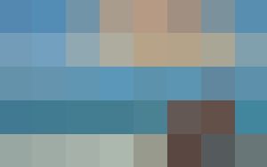
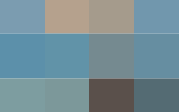

# `sqip-plugin-pixels`

> SQIP plugin to create pixelated SVG placeholders

Creates a pixelated SVG placeholder by downsampling the image to a small grid of colored rectangles. Uses [sharp](https://sharp.pixelplumbing.com/) for image downsampling and [@svgdotjs/svg.js](https://github.com/svgdotjs/svg.js) for SVG generation. The result is a tiny SVG that gives a color impression of the original image. Can be combined with the blur plugin for a smoother appearance.

## Examples

| Original (59 KB) | Pixels — 8px (1.8 KB) | Pixels + Blur (854 B) |
|---|---|---|
|  |  |  |

> Try the [interactive demo](https://sqip.vercel.app/) to compare all plugins and configurations side by side.

## Installation

```bash
npm install sqip sqip-plugin-pixels
```

## Options

| Option            | Type   | Default    | CLI Flag          | Description                                                                 |
| ----------------- | ------ | ---------- | ----------------- | --------------------------------------------------------------------------- |
| `pixels`          | Number | `8`        | `--pixels-pixels` | Number of pixels on the longer axis                                         |
| `backgroundColor` | String | `'DETECT'` |                   | Color treated as transparent — hex value with alpha (e.g. `#FFFFFF00`) or palette color name |

## Usage

### Node API

```js
import { sqip } from 'sqip'

// Sharp pixels
const result = await sqip({
  input: 'photo.jpg',
  plugins: [
    'sqip-plugin-pixels',
    'sqip-plugin-svgo',
    'sqip-plugin-data-uri',
  ],
})

// Soft pixels (with blur)
const soft = await sqip({
  input: 'photo.jpg',
  plugins: [
    { name: 'sqip-plugin-pixels', options: { pixels: 4 } },
    { name: 'sqip-plugin-blur', options: { blur: 24 } },
    'sqip-plugin-svgo',
    'sqip-plugin-data-uri',
  ],
})
```

### CLI

```bash
# Default pixels
sqip -i photo.jpg -p pixels -p svgo

# Fewer pixels with blur
sqip -i photo.jpg -p pixels -p blur -p svgo --pixels-pixels 4 -b 24
```

## Part of SQIP

This plugin is part of the [SQIP](https://github.com/axe312ger/sqip) project. See the main README for the full list of plugins and integrations.
