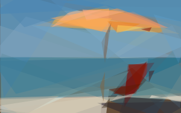

# `sqip-plugin-primitive`

> SQIP plugin to generate SVG shapes using Primitive

Generates SVG shapes that approximate the input image using [Primitive](https://github.com/fogleman/primitive). This is typically the first plugin in the SQIP pipeline — it takes a raster image and produces an SVG composed of geometric shapes (triangles, rectangles, ellipses, etc.) that resemble the original.

## Examples

| Original (59 KB) | Default — 8 shapes + blur (962 B) | Art — 50 triangles, no blur (2.9 KB) |
|---|---|---|
|  |  |  |

> Try the [interactive demo](https://sqip.vercel.app/) to compare all plugins and configurations side by side.

## Installation

```bash
npm install sqip sqip-plugin-primitive
```

> **Note:** This plugin ships with pre-built 64-bit Primitive binaries for macOS, Linux, and Windows. On non-64-bit systems, you'll need to install [Go](https://golang.org/doc/install) and [Primitive](https://github.com/fogleman/primitive) manually.

## Options

| Option                  | Type    | Default   | CLI Flag | Description                                                                                              |
| ----------------------- | ------- | --------- | -------- | -------------------------------------------------------------------------------------------------------- |
| `numberOfPrimitives`    | Number  | `8`       | `-n`     | Number of primitive shapes to generate                                                                   |
| `mode`                  | Number  | `0`       | `-m`     | Shape style: 0=combo, 1=triangle, 2=rect, 3=ellipse, 4=circle, 5=rotatedrect, 6=beziers, 7=rotatedellipse, 8=polygon |
| `rep`                   | Number  | `0`       |          | Extra shapes each iteration with reduced search (useful for beziers)                                     |
| `alpha`                 | Number  | `128`     |          | Color alpha (0 = let algorithm choose per shape)                                                         |
| `background`            | String  | `'Muted'` |          | Background color: hex value or palette color name (Vibrant, DarkVibrant, LightVibrant, Muted, DarkMuted, LightMuted) |
| `cores`                 | Number  | `0`       |          | Number of parallel workers (0 = all CPU cores)                                                           |
| `removeBackgroundElement` | Boolean | `false` |          | Remove the background rect element created by Primitive                                                  |

## Usage

### Node API

```js
import { sqip } from 'sqip'

// Default placeholder (8 shapes)
const result = await sqip({
  input: 'photo.jpg',
  plugins: [
    'sqip-plugin-primitive',
    'sqip-plugin-blur',
    'sqip-plugin-svgo',
    'sqip-plugin-data-uri',
  ],
})

// Art mode (many triangles, no blur)
const art = await sqip({
  input: 'photo.jpg',
  plugins: [
    { name: 'sqip-plugin-primitive', options: { numberOfPrimitives: 50, mode: 1 } },
    'sqip-plugin-svgo',
    'sqip-plugin-data-uri',
  ],
})
```

### CLI

```bash
# Default
sqip -i photo.jpg -p primitive -p blur -p svgo

# 25 ellipses
sqip -i photo.jpg -p primitive -p svgo -n 25 -m 3
```

## Part of SQIP

This plugin is part of the [SQIP](https://github.com/axe312ger/sqip) project. See the main README for the full list of plugins, bundler integrations, and background research.
