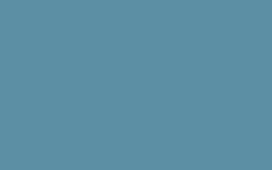

# `sqip-plugin-triangle`

> SQIP plugin to generate triangulated SVG art

Generates triangulated SVG art using Delaunay triangulation with edge detection, powered by [Triangle](https://github.com/esimov/triangle) — a Go-based Delaunay triangulation tool. Produces a mosaic of colored triangles that approximates the original image. The number and distribution of triangles can be tuned to create anything from subtle placeholders to detailed artistic renderings.

## Examples

| Original (59 KB) | Default — 6 points (1.6 KB) | Art — 420 points (74.5 KB) |
|---|---|---|
|  |  |  |

> Try the [interactive demo](https://sqip.vercel.app/) to compare all plugins and configurations side by side.

## Installation

```bash
npm install sqip sqip-plugin-triangle
```

> **Note:** This plugin ships with pre-built 64-bit Triangle binaries for macOS, Linux, and Windows.

## Options

| Option | Type    | Default   | CLI Flag | Description                                              |
| ------ | ------- | --------- | -------- | -------------------------------------------------------- |
| `bl`   | Number  | `2`       | `--bl`   | Blur radius                                              |
| `nf`   | Number  | `0`       | `--nf`   | Noise factor                                             |
| `bf`   | Number  | `1`       | `--bf`   | Blur factor                                              |
| `ef`   | Number  | `6`       | `--ef`   | Edge factor                                              |
| `pr`   | Number  | `0.075`   | `--pr`   | Point rate                                               |
| `pth`  | Number  | `10`      | `--pth`  | Points threshold                                         |
| `pts`  | Number  | `6`       | `--pts`  | Maximum number of points                                 |
| `so`   | Number  | `10`      | `--so`   | Sobel filter threshold                                   |
| `sl`   | Boolean | `false`   | `--sl`   | Use solid stroke color                                   |
| `wf`   | Number  | `0`       | `--wf`   | Wireframe mode: 0=no stroke, 1=with stroke, 2=stroke only |
| `st`   | Number  | `1`       | `--st`   | Stroke width                                             |
| `gr`   | Boolean | `false`   | `--gr`   | Grayscale mode                                           |
| `bg`   | String  | `'Muted'` | `--bg`   | Background color: hex value or palette color name        |

## Usage

### Node API

```js
import { sqip } from 'sqip'

// Default triangulation
const result = await sqip({
  input: 'photo.jpg',
  plugins: [
    'sqip-plugin-triangle',
    'sqip-plugin-blur',
    'sqip-plugin-svgo',
    'sqip-plugin-data-uri',
  ],
})

// Art mode (many triangles, no blur)
const art = await sqip({
  input: 'photo.jpg',
  plugins: [
    { name: 'sqip-plugin-triangle', options: { pts: 420 } },
    'sqip-plugin-svgo',
    'sqip-plugin-data-uri',
  ],
})
```

### CLI

```bash
# Default
sqip -i photo.jpg -p triangle -p blur -p svgo

# Art mode with many points
sqip -i photo.jpg -p triangle -p svgo --pts 420

# Wireframe mode in grayscale
sqip -i photo.jpg -p triangle -p svgo --wf 2 --gr
```

## Part of SQIP

This plugin is part of the [SQIP](https://github.com/axe312ger/sqip) project. See the main README for the full list of plugins and integrations.
